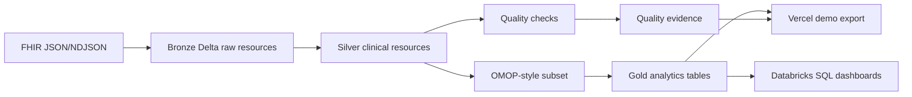
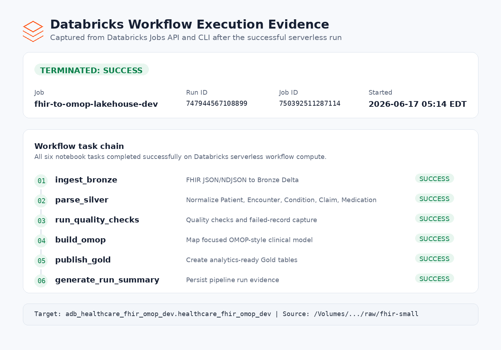
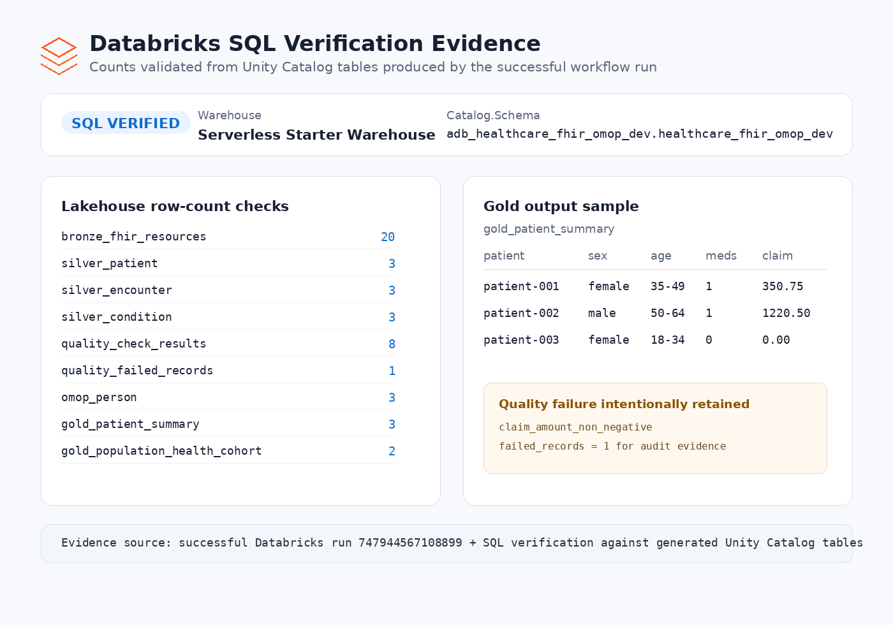

# Healthcare Interoperability Lakehouse: FHIR-to-OMOP Data Engineering Pipeline on Databricks

Production-style Databricks healthcare lakehouse pipeline that ingests synthetic FHIR JSON/NDJSON, preserves raw records in Bronze Delta tables, parses clinical resources into Silver tables, maps a focused OMOP-style model, applies data quality checks, publishes Gold analytics tables, and exposes a Vercel-ready demo with small-dataset outputs.

This is a portfolio-grade engineering project using synthetic data. It does not claim HIPAA compliance or full OMOP CDM conformance.

## Why This Project

The project follows Databricks medallion architecture: Bronze for raw ingestion and auditability, Silver for validation and normalization, and Gold for BI-ready reporting.

It is shaped by:

- Databricks lakehouse and FHIR accelerator patterns for extracting nested healthcare resources into analytics tables.
- Databricks omop-cdm: OMOP CDM setup, ETL, cohort analysis, drug analysis, and sample queries on Databricks.
- Databricks Bundles: source-controlled YAML workflows for deployable Databricks jobs.

## Repository Structure

| Path | Purpose |
| --- | --- |
| `src/healthcare_lakehouse/` | Local stdlib pipeline used for tests and Vercel demo artifact generation. |
| `databricks/notebooks/` | Spark/Delta notebook exports for the production-style Databricks workflow. |
| `databricks.yml` and `resources/jobs/` | Databricks Bundle and multi-task job definition. |
| `sampledata/fhir-small/` | Tiny synthetic FHIR JSON/NDJSON dataset for reproducible local runs. |
| `demo/vercel-app/` | Static Vercel demo that renders exported pipeline tables and quality evidence. |
| `sql/` | OMOP-style DDL and dashboard SQL examples. |
| `docs/` | Architecture, data model, runbook, validation evidence plan, source data plan, and limitations. |
| `tests/` | Local pipeline regression tests. |
| `RUNME.py` | Local smoke-test entry point that regenerates static demo data. |

## Architecture


```mermaid
flowchart LR
    A[FHIR JSON/NDJSON] --> B[Bronze Delta raw resources]
    B --> C[Silver clinical resources]
    C --> D[Quality checks]
    C --> E[OMOP-style subset]
    D --> F[Quality evidence]
    E --> G[Gold analytics tables]
    G --> H[Databricks SQL dashboards]
    G --> I[Vercel demo export]
    F --> I
```

## Tables

Bronze:

- `bronze_fhir_resources`
- `bronze_ingestion_audit`
- `bronze_rejected_records`

Silver:

- `silver_patient`
- `silver_encounter`
- `silver_condition`
- `silver_observation`
- `silver_medication`
- `silver_claim`
- `silver_procedure`
- `silver_provider`

Quality:

- `quality_check_results`
- `quality_failed_records`
- `quality_run_summary`

OMOP-style:

- `omop_person`
- `omop_visit_occurrence`
- `omop_condition_occurrence`
- `omop_measurement`
- `omop_drug_exposure`
- `omop_procedure_occurrence`
- `omop_payer_plan_period`

Gold:

- `gold_patient_summary`
- `gold_condition_prevalence`
- `gold_encounter_utilization`
- `gold_claim_cost_summary`
- `gold_medication_usage`
- `gold_population_health_cohort`

## Local Run

Generate the Vercel demo artifacts from the bundled small dataset:

```bash
python3 scripts/run_local_pipeline.py
```

Run checks:

```bash
python3 -m unittest discover -s tests
python3 -m py_compile RUNME.py 00-README.py scripts/run_local_pipeline.py src/healthcare_lakehouse/*.py databricks/notebooks/*.py
```

Expected local demo result:

- 20 Bronze FHIR resources
- 3 patients
- 3 encounters
- 3 conditions
- 2 population-health cohort members
- 8 quality checks
- 1 intentional failed quality record for a negative claim amount

## Vercel Demo

Live demo:

https://vercel-app-brown-delta.vercel.app

Serve locally:

```bash
cd demo/vercel-app
python3 -m http.server 4173
```

Open:

```text
http://localhost:4173
```

Vercel should host `demo/vercel-app` as a static project. The app displays exported JSON tables from `public/data`; it is not a live Databricks workspace or a FHIR processing service.

## Databricks Execution Evidence

The pipeline was rerun in Azure Databricks on June 17, 2026 using serverless workflow compute. The workspace UI is private behind Microsoft Entra login, so the README uses sanitized evidence images generated from Databricks Jobs API/CLI output and SQL verification results instead of a login-gated screenshot.





This evidence shows the successful job run, all six notebook tasks, the Unity Catalog target, table row-count checks, sample Gold output, and the intentional failed quality record retained for auditability.

## Databricks Run

Configure the Databricks CLI, upload source data to a workspace-accessible location, then run:

```bash
databricks bundle validate -t dev
databricks bundle deploy -t dev
databricks bundle run fhir_to_omop_job -t dev
```

Important variables:

| Variable | Default | Description |
| --- | --- | --- |
| `target_catalog` | `adb_healthcare_fhir_omop_dev` | Unity Catalog catalog for generated tables. Override this in your own workspace. |
| `target_schema` | `healthcare_fhir_omop_dev` | Schema/database for pipeline tables. |
| `fhir_source_path` | `/Volumes/adb_healthcare_fhir_omop_dev/healthcare_fhir_omop_dev/raw/fhir-small` | FHIR JSON/NDJSON source path. Override this after staging data in your own workspace. |

See [docs/runbook.md](docs/runbook.md) for more detail.

For local, public-demo, and Databricks evidence expectations, see [docs/validation.md](docs/validation.md).

Current validation status: local tests pass, the Vercel demo is deployed, Databricks execution evidence is included above, and the Databricks workflow has completed successfully using serverless workflow compute.

## Source Data

The repository commits only a tiny synthetic sample. Larger datasets should be staged externally:

- Kaggle Synthea FHIR JSON dataset: https://www.kaggle.com/datasets/krsna540/synthea-dataset-jsons-ehr
- Kaggle FHIR 1k sample: https://www.kaggle.com/datasets/drscarlat/fhir-1ksample

Do not commit large Kaggle datasets to GitHub.

## Limitations

This project demonstrates production-grade engineering patterns with synthetic healthcare data. A real healthcare production platform would still need PHI governance, identity and access controls, audit logging, encryption policy, monitoring, backup and disaster recovery, cost governance, compliance review, and a signed BAA where applicable.

See [docs/limitations.md](docs/limitations.md).

## Author

Thrivikrama Rao Kavuri

GitHub: [VikramKavuri](https://github.com/VikramKavuri)

LinkedIn: [thrivikrama-rao-kavuri-7290b6147](https://www.linkedin.com/in/thrivikrama-rao-kavuri-7290b6147/)

## License

This project is licensed under the MIT License. See [LICENSE](LICENSE).
