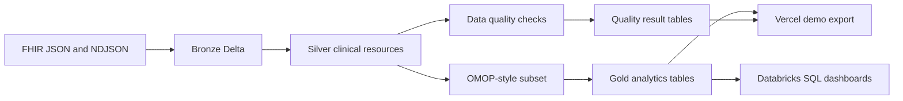

# Architecture

## Project Goal

Healthcare Interoperability Lakehouse: FHIR-to-OMOP Data Engineering Pipeline on Databricks turns synthetic FHIR JSON/NDJSON into curated analytics tables using production-style lakehouse patterns.

The design is intentionally honest:

- Databricks is the compute layer for Spark, Delta, jobs, and SQL.
- The local Python runner exists for fast tests and for producing Vercel demo artifacts.
- Vercel hosts a public proof surface with sample data, quality results, SQL examples, and run evidence.
- The project uses synthetic healthcare data only and does not claim HIPAA compliance.

## Reference Patterns

- Databricks medallion architecture: Bronze preserves raw fidelity, Silver validates and normalizes, Gold supports analytics and reporting.
- Databricks lakehouse and FHIR accelerator patterns for extracting nested healthcare resources into analytics tables.
- Databricks omop-cdm: Lakehouse-oriented OMOP CDM setup, vocabulary setup, ETL, cohort analysis, drug analysis, and sample OMOP SQL.
- Databricks Bundles: YAML-defined jobs and resources for versioned deployment and workflow runs.

## Flow

## Layers

### Bronze

Tables:

- `bronze_fhir_resources`
- `bronze_ingestion_audit`
- `bronze_rejected_records`

Bronze stores resource lineage, source file, resource type, resource id, raw JSON, hash, parse status, batch id, and ingestion timestamp.

### Silver

Tables:

- `silver_patient`
- `silver_encounter`
- `silver_condition`
- `silver_observation`
- `silver_medication`
- `silver_claim`
- `silver_procedure`
- `silver_provider`

Silver is the validated, flattened clinical model used by quality checks and downstream mapping.

### Quality

Tables:

- `quality_check_results`
- `quality_failed_records`
- `quality_run_summary`

Checks cover null identifiers, valid birth dates, patient references, observation coding, non-negative claim amounts, duplicates, and encounter referential integrity.

### OMOP-Style

Tables:

- `omop_person`
- `omop_visit_occurrence`
- `omop_condition_occurrence`
- `omop_measurement`
- `omop_drug_exposure`
- `omop_procedure_occurrence`
- `omop_payer_plan_period`

This is a focused subset, not a full OMOP CDM implementation with official vocabulary concept mapping.

### Gold

Tables:

- `gold_patient_summary`
- `gold_condition_prevalence`
- `gold_encounter_utilization`
- `gold_claim_cost_summary`
- `gold_medication_usage`
- `gold_population_health_cohort`

Gold tables are built for SQL dashboards and portfolio walkthroughs.
